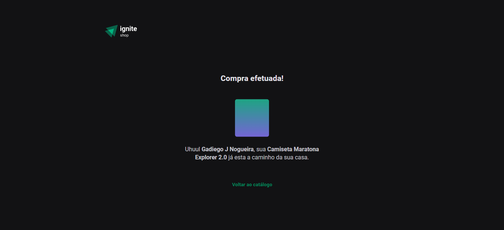

# Aplicação ReactJs

> Ignite Shop - Camisetas Rocketseat

    Projeto contruido no curso de ReactJs, tilha  Ignite da RocketSeat!

- Tela do produto selecionado

- Tela de pagamento do Stripe

- Tela de compra efetuada com sucesso

## Tecnologias utilizadas
    - NextJs
    - Figma
    - TypeScript
    - Stripe
    - Git
    - Github

## Contato
    ngadiego@gmail.com